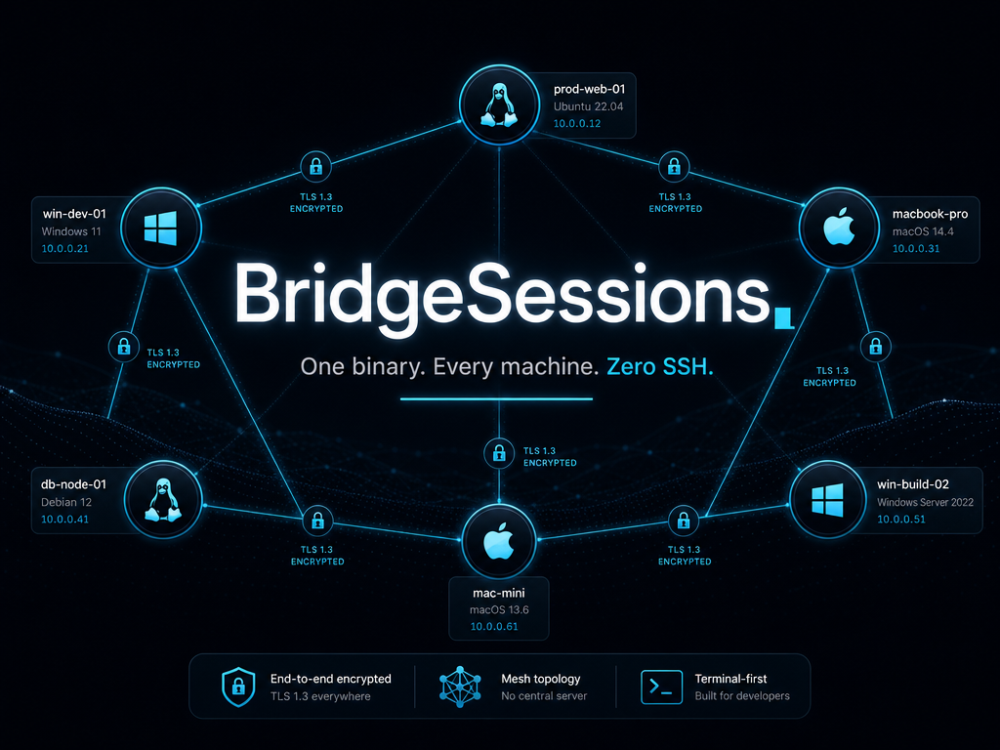

<div align="center">



# BridgeSessions

### One binary. Every machine. Zero SSH.

[](https://codeberg.org/Mind-Dragon/BridgeSessions/releases)
[](LICENSE)
[](#install)
[](https://en.cppreference.com/)
[](tests/)

**Mesh terminal relay** — replaces SSH + MOSH + SCP + tmux + WinRM with a single encrypted mesh (`bs://` over TLS 1.3). Built for humans **and** AI agents.

[Install](#install) ·
[Quickstart](#quickstart) ·
[Features](#features) ·
[Comparison](#vs-ssh--scp--winrm) ·
[CUA](#computer-use-automation) ·
[Docs](#documentation)

</div>

### Product demo

[](docs/assets/demo-install-ai-mesh.mp4)

*Install → mesh → AI CUA → media/vision → Bridge Panel (22s loop).*  
Full quality: **[MP4 · 1080p](docs/assets/demo-install-ai-mesh.mp4)**

---

## The Problem

Every remote machine task today chains together a pile of disconnected tools:

```
ssh server → tmux attach → work → detach → scp files back → winrm to Windows box → ...
```

Each tool has its own auth, escaping rules, failure modes, and security surface. AI agents struggle with all of them — `$_` escaping in PowerShell, SSH key management across containers, WinRM's broken Unicode handling, SCP's lack of progress reporting.

**BridgeSessions replaces all of it with one binary.**

## Features

### 🔐 Encrypted Mesh Network
- **ed25519 mutual TLS 1.3** — every connection authenticated, encrypted, forward-secret
- **Peer-to-peer mesh** — connect any machine to any machine, no central server
- **TOFU key pinning** — first contact establishes trust, subsequent connections verify identity
- **Zero passwords** — cryptographic identity, not credentials

### 🖥️ Persistent Sessions
- **Durable PTYs** — disconnect and reattach, the terminal keeps running
- **Multi-attach** — multiple clients on the same session simultaneously
- **Spectator mode** — watch without controlling (pair programming, demos)

### 📁 Fast File Transfer
- **Direct TLS path** — works even without daemon mesh connection
- **Streaming SHA-256** — verified integrity, no full-file RAM buffering
- **Pipeline depth 16** — 768KB/batch, 3× faster than v2.x
- **Bidirectional** — `send` and `recv` work identically on Linux, Windows, macOS
- **Progress reporting** — machine-parseable `PROGRESS` lines for agents

### 🤖 Computer-Use Automation (CUA)
- **Remote screen capture** — screenshot any peer over the mesh
- **Input injection** — click, type, scroll on remote machines
- **Agent-native** — designed for AI agents driving remote desktops
- **Cross-platform** — Linux (xdotool), Windows (SendInput), macOS (CGEvent)

```bash
bs cua screen windows-peer        # → 1920x1080
bs cua capture windows-peer -o shot.png
bs cua click windows-peer --x 500 --y 300
bs cua type windows-peer --text "Hello World"
```

### 📜 Script Library
- **Content-addressed** — SHA256 cache, no re-transfer of unchanged scripts
- **Fleet-wide** — push once, run on any peer
- **Zero escaping** — base64-encoded, eliminates PowerShell/bash quoting hell

```bash
bs script add deploy.sh --name deploy
bs script push deploy --peer linux-a
bs script run deploy --peer linux-a -- --env prod
```

### 🔍 Smart Peer Resolution
- **4-tier fuzzy matching** — exact → suffix → Levenshtein → suggestions
- **Alias support** — `shadow` resolves to `windows-peer`
- **"Did you mean...?"** — never leaves you guessing

### 🛡️ Built for AI Agents
- **SKILL.md + AGENTS.md** — multi-harness agent instructions (Hermes, Claude, Codex, Cursor, OpenCode)
- **`run-script`** — base64-encoded execution, zero shell injection risk
- **Rich error diagnostics** — per-reason guidance (`refused`, `timeout`, `tls_rejected`, `hello_rejected`)
- **No-SSH-fallback contract** — the mesh IS the transport, no silent SSH/WinRM fallback
- **Bridge Panel** — agent-friendly Markdown surface for long-form reviews

---

## Install

### One-line install (Linux / macOS)

```bash
curl -fsSL https://codeberg.org/Mind-Dragon/BridgeSessions/raw/tag/26.08.06-beta1/scripts/install.sh | bash
```

### Windows (PowerShell)

```powershell
irm https://codeberg.org/Mind-Dragon/BridgeSessions/raw/tag/26.08.06-beta1/scripts/install.ps1 | iex
```

### Build from source

```bash
git clone https://codeberg.org/Mind-Dragon/BridgeSessions.git
cd BridgeSessions
cmake -S . -B build -DCMAKE_BUILD_TYPE=Release
cmake --build build --parallel
./build/bridgesessions --version   # → 26.08.06-beta1
```

<details>
<summary>Build dependencies</summary>

| Platform | Dependencies |
|----------|-------------|
| **Linux** | `cmake gcc openssl fmt spdlog zstd nlohmann-json catch2` |
| **macOS** | `brew install cmake openssl@3 fmt spdlog zstd nlohmann-json` |
| **Windows** | MinGW-w64 (`x86_64-w64-mingw32-g++`) + static OpenSSL/zstd/fmt/spdlog |

</details>

---

## Quickstart

```bash
# 1. Generate a keypair (once per machine)
bridgesessions keygen

# 2. Start the daemon (background mesh service)
bridgesessions --daemon --config ~/.bridgesessions/config

# 3. From any other machine — connect, run, transfer
bs health linux-a                    # → healthy (data-plane ok)
bs shell linux-a --cmd 'uname -a'   # → Linux linux-a 6.8.0...
bs file send linux-a ./app.tar.gz   # → OK sent app.tar.gz SHA256:...
bs shell windows-peer --cmd 'hostname'  # → SHADOW-OLNM5J3N
bs cua capture macos-peer -o screen.png    # → screenshot from Mac mini
```

<details>
<summary>Configuration file (~/.bridgesessions/config)</summary>

```ini
node.name   my-laptop
node.listen 0.0.0.0:19949
seed example-peer <tailnet-ip>:19949 pubkey=<hex-pubkey>
mesh.gossip_interval_secs 30
mesh.startup_wait_secs 30
receive_dir ~/.bridgesessions/received
```

</details>

---

## vs SSH + SCP + WinRM

| Feature | SSH + SCP + tmux + WinRM | BridgeSessions |
|---------|:------------------------:|:--------------:|
| **One binary** | ❌ 4+ tools | ✅ `bridgesessions` |
| **Cross-platform** | ❌ WinRM ≠ SSH ≠ MOSH | ✅ Same binary, same protocol |
| **Persistent sessions** | Need tmux/Zellij | ✅ Built in |
| **Encrypted file transfer** | SCP (no progress) | ✅ Streaming SHA-256 + progress |
| **AI agent friendly** | ❌ Escaping hell | ✅ `run-script` + `bs script` |
| **Remote desktop / CUA** | ❌ Separate VNC/RDP | ✅ `bs cua` built in |
| **Mesh topology** | ❌ Point-to-point | ✅ Full mesh with gossip |
| **Peer name resolution** | ❌ DNS or /etc/hosts | ✅ 4-tier fuzzy + aliases |
| **Error diagnostics** | `Connection refused` | ✅ Per-reason guidance |
| **Port forwarding** | ❌ Manual tunnels | ✅ Mesh routing |
| **Session persistence on restart** | ❌ Lost | ✅ Save on shutdown |
| **Self-hosting / no central server** | ❌ Need sshd | ✅ Daemon = server + client |
| **License** | Various | BSL-1.1 → Apache-2.0 |

### What BridgeSessions does NOT replace

- **Interactive SSH login** for one-off admin tasks — BS is heavier to set up (keypair + config)
- **SCP for tiny files** — overhead of TLS + mesh for a 1KB config edit
- **SSH port forwarding** for database tunnels — BS mesh routes connections, not arbitrary TCP

---

## Computer-Use Automation

```bash
# Screen dimensions
bs cua screen <peer>                    # → 1920x1080

# Screenshot
bs cua capture <peer> -o screenshot.png

# Mouse
bs cua click <peer> --x 100 --y 200     # left click
bs cua move <peer> --x 500 --y 300      # move cursor
bs cua scroll <peer> --direction down   # scroll wheel

# Keyboard
bs cua type <peer> --text "Hello World"
bs cua key <peer> --code 40             # HID Enter key
```

**Platform support:**

| Platform | Screen Capture | Input Injection | Setup |
|----------|:--------------:|:---------------:|-------|
| **Linux** | ✅ grim/import/scrot | ✅ xdotool | Install xdotool |
| **Windows** | ✅ GDI (built-in) | ✅ SendInput via cua-helper | `bridgesessions --cua-helper` in user session |
| **macOS** | ✅ ScreenCaptureKit | ✅ CGEvent via cua-helper | `bridgesessions --cua-helper` + Accessibility permission |

---

## Documentation

| Document | What it covers |
|----------|----------------|
| [docs/cua.md](docs/cua.md) | CUA commands, platform setup, HID key codes, workflows |
| [docs/QUICKSTART.md](docs/QUICKSTART.md) | Fast-start guide with examples |
| [docs/configuration.md](docs/configuration.md) | Full config file reference |
| [docs/protocol.md](docs/protocol.md) | The `bs://` wire protocol specification |
| [docs/building.md](docs/building.md) | Compile on Linux / Windows / macOS |
| [docs/bridge-panel.md](docs/bridge-panel.md) | Bridge Panel web surface |
| [docs/ARCHITECTURE-DECISION-RECORD.md](docs/ARCHITECTURE-DECISION-RECORD.md) | Design decisions and component model |
| [docs/ARCHITECTURE-RECOMMENDATIONS.md](docs/ARCHITECTURE-RECOMMENDATIONS.md) | Future roadmap and recommendations |

---

## For AI Agents

BridgeSessions ships multi-harness agent instructions:

| File | Role |
|------|------|
| [`AGENTS.md`](AGENTS.md) | Always-on project rules (AGENTS.md standard) |
| [`CLAUDE.md`](CLAUDE.md) | Symlink → `AGENTS.md` for Claude Code |
| [`skills/bridgesessions/SKILL.md`](skills/bridgesessions/SKILL.md) | Portable Agent Skills skill |

**Load the skill** when operating `bs` mesh, Windows peers, large file transfer, CUA, or release hardening.

---

## Architecture

```
┌─────────────┐     TLS 1.3      ┌─────────────┐     TLS 1.3      ┌─────────────┐
│  Mac (agent) │◄────────────────►│  Linux box  │◄────────────────►│  Windows PC │
│  bs daemon   │     ed25519      │  bs daemon   │     ed25519      │  bs daemon  │
│  bs CLI      │     mesh gossip  │  PTY sessions│     file transfer│  CUA helper │
└─────────────┘                   └─────────────┘                   └─────────────┘
       │                                                               │
       │  TLS 1.3                                                      │ TLS 1.3
       ▼                                                               ▼
┌─────────────┐                                             ┌─────────────┐
│  Mac mini   │◄─────────── mesh gossip ───────────────────►│  Docker box │
│  bs daemon   │                                             │  bs daemon  │
└─────────────┘                                             └─────────────┘
```

- **One C++23 binary** — client, server, daemon, CUA helper, all in `bridgesessions`
- **Source:** `bs-protocol.h` + `main.cpp` (~14K lines single header)
- **Protocol:** `bs://` over TLS 1.3 with ed25519 mutual auth
- **Default port:** 19949 (mesh), 19980 (local IPC), 19986 (CUA helper)

---

## Releases

| Platform | Artifact |
|----------|----------|
| Linux x86_64 | `bridgesessions-linux-x86_64` |
| Windows x86_64 | `bridgesessions-windows-x86_64.exe` |
| macOS arm64 | `bridgesessions-macos-arm64` |

Current release: **`26.08.06-beta1`** on Codeberg.

```bash
# Verify checksums
sha256sum -c SHA256SUMS
```

---

## Contributing

See [CONTRIBUTING.md](CONTRIBUTING.md). Bug reports and pull requests welcome.

## Security

Found a vulnerability? Follow the disclosure process in [SECURITY.md](SECURITY.md).

## License

**Business Source License 1.1** (BSL-1.1). Production and commercial use permitted with one carve-out (you may not operate it as a hosted remote-terminal service). Converts to **Apache-2.0** on **2030-07-16**. See [LICENSE](LICENSE).

---

<div align="center">

**[⬆ Back to top](#bridgesessions)**

Built by [Mind Dragon Labs](https://codeberg.org/Mind-Dragon) · Powered by C++23 + OpenSSL + ❤️

</div>
