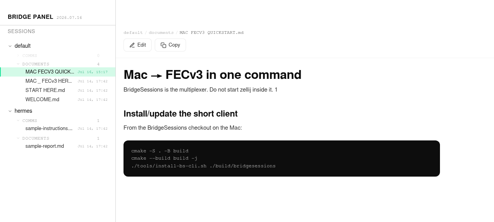
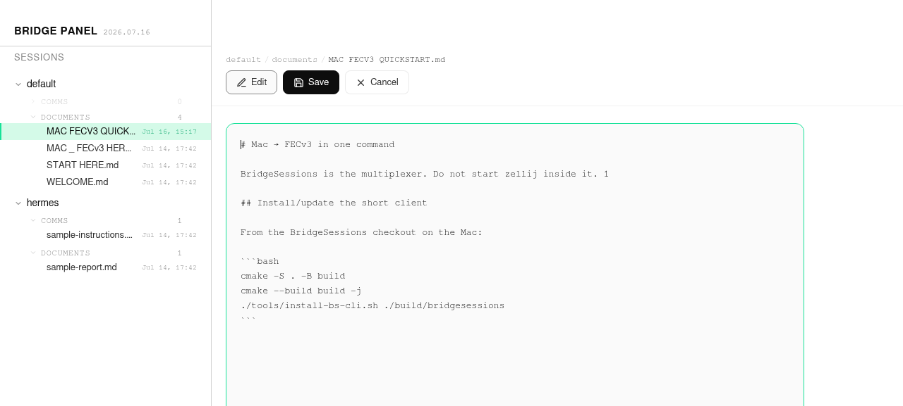

# Bridge Panel

Bridge Panel is a small web surface bundled with BridgeSessions. It lets a node
publish Markdown documents into a session so peers can browse and read them in a
browser — with edit, save, copy, and a breadcrumb that mirrors the mesh tree.

It is served by the BridgePanel process and binds to loopback by default. An
operator may bind it to a VPN address explicitly after configuring trusted read
sources; never expose it directly to the public internet.

## Features

- **Session tree** — the left sidebar lists sessions → types → files, exactly
  as they exist on the node.
- **Breadcrumb** — `session / type / file`, aligned with the "Sessions" header.
- **Tools bar** — outlined icon buttons:
  - **Edit** — switch a document into an inline Markdown editor.
  - **Save** — write the edited Markdown back to disk under `sessions/`.
  - **Cancel** — discard edits and return to read view.
  - **Copy** — copy the raw Markdown to the clipboard.
- **Markdown rendering** — GitHub-flavored Markdown with code highlighting.
- **Build tag** — the titlebar shows the build number, injected server-side.

## Publishing a file

From the mesh CLI:

```bash
bridgesessions pane publish <file.md> \
    --session default --type documents --title "My Note"
```

This copies the local file into the node's BridgePanel surface under
`default / documents`. Loopback clients can read it by default; remote VPN reads
require the panel's explicit trusted-IP configuration.

## Screenshots

### Read mode



Sidebar session tree, breadcrumb aligned with **SESSIONS**, outlined **Edit** /
**Copy** tools, rendered Markdown body.

### Edit mode



Inline Markdown source with **Save** / **Cancel**. Agents publish long reports
here; humans review without drowning in chat scrollback.

## Editing model

When a file is editable, the **Edit** button swaps the rendered document for a
textarea. **Save** persists it via the same API the panel uses to read content;
**Cancel** reverts. **Copy** works in both read and edit views and copies the
raw source.

## Security notes

- The panel binds to `127.0.0.1` by default. VPN/LAN binding is an explicit
  operator decision, not the default security boundary.
- Editing requires the file to be writable by the panel process; read-only
  documents show only **Copy**.
- Every write requires the generated bearer token. Remote reads are allowed only
  for explicitly trusted IPs when that mode is configured.
- Do not expose the panel port publicly, even when write authentication is on.
